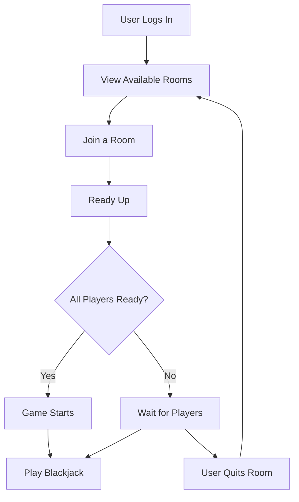

# Blackjack Game Application

This application allows users to log in, view available blackjack rooms, join a room, and play a game once all players are ready. The following documentation provides a high-level overview of the user interactions and the main use cases of the system.

## User Story Map

The User Story Map illustrates the primary goals that users want to achieve when interacting with the blackjack game application. Each user goal is broken down into specific actions that the user can take.

### **User Goals**

1. **As a User, I want to log in so that I can access the blackjack rooms.**
   - View available rooms after logging in.
   - Filter rooms by availability and game state.

2. **As a User, I want to join a room so that I can participate in a blackjack game.**
   - Select a room that hasn't started yet and has available space.
   - Ready up to signal I am prepared to play.

3. **As a User, I want to start a game once all players are ready.**
   - Automatically start the game when all players are ready.

4. **As a User, I want the ability to quit a room if I change my mind before the game starts.**
   - Quit the current room before the game starts.
   - Rejoin the same room or select a different one after quitting.

5. **As a User, I want to be able to wait if not all players are ready.**
   - Stay in the room and wait for other players to signal they are ready.

### **User Story Flow**

This flowchart shows the sequence of actions a user takes from logging in to playing a blackjack game, including additional possibilities like quitting a room.

### **Explanation of the Updated Flow:**

1. **Login and Viewing Rooms**:
   - The user logs in and views the available blackjack rooms, as before.

2. **Joining a Room**:
   - The user selects and joins a room.

3. **Ready Up**:
   - After joining, the user signals that they are ready to start the game.

4. **Checking If All Players Are Ready**:
   - The system checks whether all players in the room are ready to begin the game.

5. **All Players Ready**:
   - If all players are ready, the game starts.

6. **Not All Players Ready**:
   - If not all players are ready, the system waits for the remaining players.

7. **User Quits Room**:
   - While waiting, the user has the option to quit the room. If they do, they are returned to the screen where they can view and join other available rooms.

8. **Rejoining or Selecting a Different Room**:
   - After quitting, the user can choose to join the same room again or select a different room to join.

9. **Playing the Game**:
   - Once the game starts, the user plays blackjack, completing the main flow.
